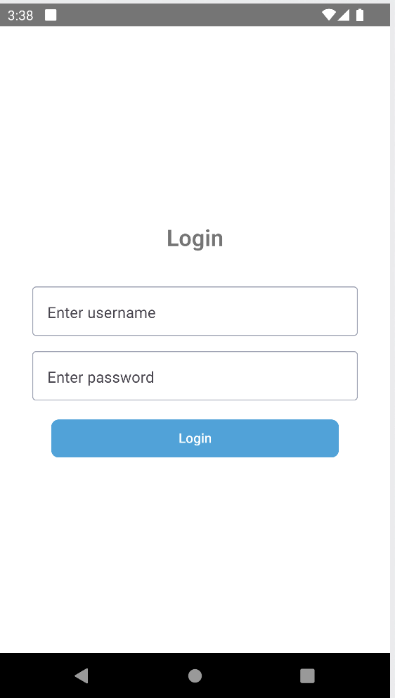

This is a new [**React Native**](https://reactnative.dev) project, bootstrapped using [`@react-native-community/cli`](https://github.com/react-native-community/cli).

# Getting Started

> **Note**: Make sure you have completed the [React Native - Environment Setup](https://reactnative.dev/docs/environment-setup) instructions till "Creating a new application" step, before proceeding.

## Step 1 Setup Instructions:

Clone the repository:
git clone https://github.com/rajavarri/home-unlocker
cd home-unlocker

install node modules :
-> using npm
npm install

-> OR using Yarn
yarn install

## Step 2: Start the Metro Server

First, you will need to start **Metro**, the JavaScript _bundler_ that ships _with_ React Native.

To start Metro, run the following command from the _root_ of your React Native project:

```bash
# using npm
npm start

# OR using Yarn
yarn start
```

## Step 3: Start your Application

Let Metro Bundler run in its _own_ terminal. Open a _new_ terminal from the _root_ of your React Native project. Run the following command to start your _Android_ or _iOS_ app:

### For Android

```bash
# using npm
npm run android

# OR using Yarn
yarn android
```

### For iOS

```bash
# using npm
npm run ios

# OR using Yarn
yarn ios
```

If everything is set up _correctly_, you should see your new app running in your _Android Emulator_ or _iOS Simulator_ shortly provided you have set up your emulator/simulator correctly.

This is one way to run your app — you can also run it directly from within Android Studio and Xcode respectively.

## Project Structure:

home-unlocker/
|-- src/
| |-- config/
| | |-- config.ts
| |-- enums/
| | |-- homeStateEnum.ts
| | |-- roleTypeEnum.ts
| |-- mock/
| | |-- homes.json
| | |-- users.json
| |-- navigation/
| | |-- index.tsx
| |-- screens/
| | |-- loginScreen.tsx
| | |-- homeListScreen.tsx
| | |-- homeDetailsScreen.tsx
| |-- styles/
| | |-- colorCodes.tsx
| | |-- globalStyles.tsx
| |-- routes/
| | |-- types.tsx
| |-- utils/
| | |-- ignoreWarning.ts
| | |-- distanceCalculator.ts
| |-- services/
| | |-- homeService.ts
| | |-- authService.ts
|-- types.ts
|-- index.js
|-- package.json
|-- tsconfig.json
|-- yarn.lock
|-- App.tsx
|-- NotificationConfig.ts

# Screenshots



# Major Dependencies Installed

-> react-native: The core framework for building native apps using React.
-> react-navigation: For navigation between screens.
-> react-native-paper: For UI components.
-> react-native-gesture-handler: For handling gestures.
-> react-native-community/geolocation: For accessing device location.
-> react-native-push-notification: For local notifications.
-> react-native-toast-message: For displaying toast messages.

# Development Tools Used

-> Node.js: v18.18.0
-> npm: v9.8.1
-> OpenJDK: 17.0.10
-> Android Studio: Dolphin (Build #AI-213.7172.25.2113.9123335)
-> Xcode: 15.4

# Functionality and Flow

-> Authentication :
-> Login Screen (loginScreen.tsx):
-> Users can log in as either an admin or a regular user.
-> Mock data for users is stored in src/mock/users.json.

-> Home List :
-> Home List Screen (homeListScreen.tsx):
-> Displays a list of homes.
-> Fetches data from src/services/homeService.ts.
-> Homes data is stored in src/mock/homes.json.
-> Home Details :
-> Home Details Screen (homeDetailsScreen.tsx):
-> Displays detailed information about a selected home.
-> Allows users to lock/unlock the home if they are within a certain distance.
-> Uses react-native-community/geolocation to get user location.
-> Uses react-native-push-notification for local notifications.

-> Distance Calculation In homeDetailsScreen:
-> The app calculates the distance between the user's location and the home's location using the Haversine formula.
-> If the user is within 30 meters of the home, they can lock/unlock it.
-> Admin and User Roles :
-> Admin:
-> Can lock/unlock any home regardless of distance.
-> Receives notifications when any user is within 30 meters of a home.
-> User:
-> Can only lock/unlock homes if they are within 30 meters.
-> Receives notifications when they are within 30 meters of a home.

# Learn More

To learn more about React Native, take a look at the following resources:

- [React Native Website](https://reactnative.dev) - learn more about React Native.
- [Getting Started](https://reactnative.dev/docs/environment-setup) - an **overview** of React Native and how setup your environment.
- [Learn the Basics](https://reactnative.dev/docs/getting-started) - a **guided tour** of the React Native **basics**.
- [Blog](https://reactnative.dev/blog) - read the latest official React Native **Blog** posts.
- [`@facebook/react-native`](https://github.com/facebook/react-native) - the Open Source; GitHub **repository** for React Native.
